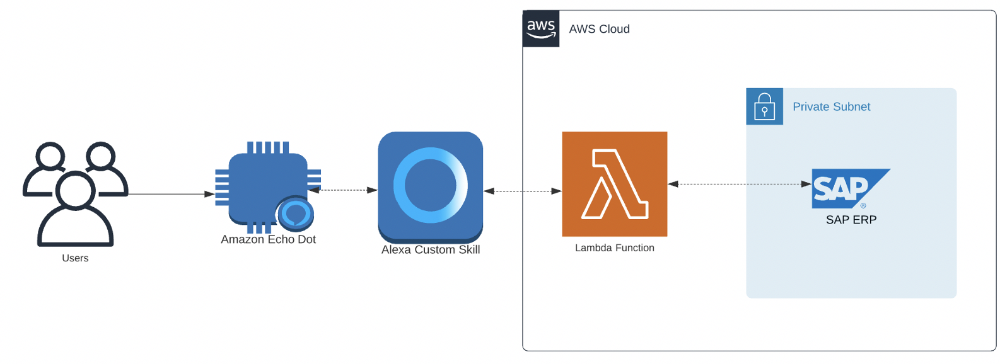

# Integrando SAP ERP con Alexa

Este es un ejemplo práctico de integración entre nuestra asistente virtual Alexa con SAP ERP, mediante nuestro servicio de cómputo sin servidores AWS Lambda. A través de comandos de voz realizaremos aprobaciones de ordenes de compras generadas en el sistema SAP ERP.
Es importante recalcar que este es un ejemplo por lo que no debe ser considerado como una solución final para implementar en ambientes productivos.

## Arquitectura de solución
La arquitectura de esta solución se basa en la implementación de función Lambda que será invocada mediante Intents definidos en Alexa. Está función implementarán la lógica de negocio y se comunicaran directamente con AS ABAP para ejecutar acciones en el sistema SAP ERP como lo explica el siguiente diagrama:

## Prerequisitos
Los siguientes son los prerequisitos:
•	SAP NetWeaver ABAP 4.6C o superior (ECC, S4, BW, …)
o	SAP RFC usuario y password con perfiles asociados.

•	SAP S-User para descargar RFC Netweaver Lib

•	Cuenta de desarrollador en Alexa Console (https://developer.amazon.com/alexa/console/ask)

•	SAP Business Workflow y Estrategias de Liberación configurados para trabajar aprobación de Órdenes de Compra.

•	Grupo de Seguridad para VPC que permita comunicación desde función Lambda hasta VPC privada en puerto 33 <número de instancia ABAP>.

## Paso a Paso
### Paso 1: Creación de Layer Lambda
Para lograr la comunicación entre Lambda y AS ABAP crearemos un Lambda Layer que incluya driver PyRFC provisto por SAP para desarrollo en Python. La guía paso a paso en el siguiente [link].

### Paso 2: Creación de Funciones Lambda
El endpoint con la lógica de para responder a Intents de Alexa corresponde a una función Lambda escrita en Python. Para acceder al paso a paso y código ejemplo ingresar aquí.

### Paso 3: Implementar modelo en Alexa
Luego de generar la función Lambda que actuará como Handler para el Skill de Alexa, procedemos a implementar el modelo de interacción de Alexa. Es aquí donde se definen las solicitudes que el usuario puede hacer a Alexa y que método de la función será el que ejecute acción. La guía paso a paso aquí.

En el siguiente [link](Alexa-SAP-Integration.mp4) un video de la solución final funcionando en un dispositivo Amazon Echo Dot.
