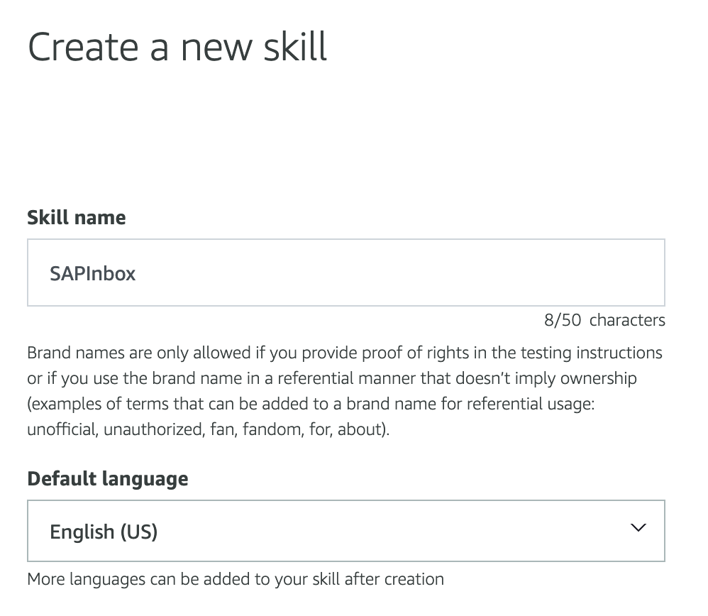

### Create Alexa Custom Skill:

1) Log in to the Alexa Developer Console (https://developer.amazon.com/alexa/console/ask) with a developer account. If you don't have an account, please create one.

2) In the console press “Create Skill”:


3) Enter a name for the Skill and default language:



Select Custom Model:


Select “Provision your own”:


Then “Create Skill”

4) In the Template selection screen select “Start from scratch”:


5) On the next screen, select “Interaction Model->JSON Editor”:


6) Copy and paste the following code:
```JSON
{
    "interactionModel": {
        "languageModel": {
            "invocationName": "s a p  inbox",
            "intents": [
                {
                    "name": "AMAZON.FallbackIntent",
                    "samples": []
                },
                {
                    "name": "AMAZON.CancelIntent",
                    "samples": []
                },
                {
                    "name": "AMAZON.HelpIntent",
                    "samples": []
                },
                {
                    "name": "AMAZON.StopIntent",
                    "samples": [
                        "exit",
                        "cancel"
                    ]
                },
                {
                    "name": "AMAZON.NavigateHomeIntent",
                    "samples": []
                },
                {
                    "name": "ContarItems",
                    "slots": [],
                    "samples": [
                        "How many documents do I have pending approval",
                        "number of documents",
                        "how many documents do i have",
                        "how many documents do i have in my inbox",
                        "how many documents do i have pending",
                        "how many documents do i have to approve"
                    ]
                },
                {
                    "name": "DocumentoAntiguo",
                    "slots": [],
                    "samples": [
                        "Find the most overdue document to approve."
                    ]
                },
                {
                    "name": "AMAZON.YesIntent",
                    "samples": []
                },
                {
                    "name": "AMAZON.NoIntent",
                    "samples": []
                },
                {
                    "name": "AprobarPedido",
                    "slots": [],
                    "samples": [
                        "approve document"
                    ]
                },
                {
                    "name": "BuscarPedido",
                    "slots": [
                        {
                            "name": "nro_pedido",
                            "type": "AMAZON.NUMBER"
                        }
                    ],
                    "samples": [
                        "search document {nro_pedido}"
                    ]
                },
                {
                    "name": "BuscarPedidoPorNumero",
                    "slots": [
                        {
                            "name": "fin_nro_pedido",
                            "type": "AMAZON.FOUR_DIGIT_NUMBER"
                        }
                    ],
                    "samples": [
                        "search document ending with {fin_nro_pedido}"
                    ]
                }
            ],
            "types": []
        }
    }
}
````

7) Press “Save Model” and then “Build Model”. The model will be ready after a few seconds.

8) In the Alexa console select “Endpoint” and copy the Skill's ID:


9) Go to the function in Lambda console and select “Add Trigger”. For the trigger type select "Alexa Skills Kit" and enter the Skill's ID previously copied:


Copy the ARN of the Lambda function:


9) Return to the Alexa console and in default region paste the ARN of the lambda function previously copied:


Then “Save endpoints”

10) For testing purposes, go to the top menu “Test” and write or speak “Open SAP Inbox”. Alexa should reply with the Skill's welcome message:


