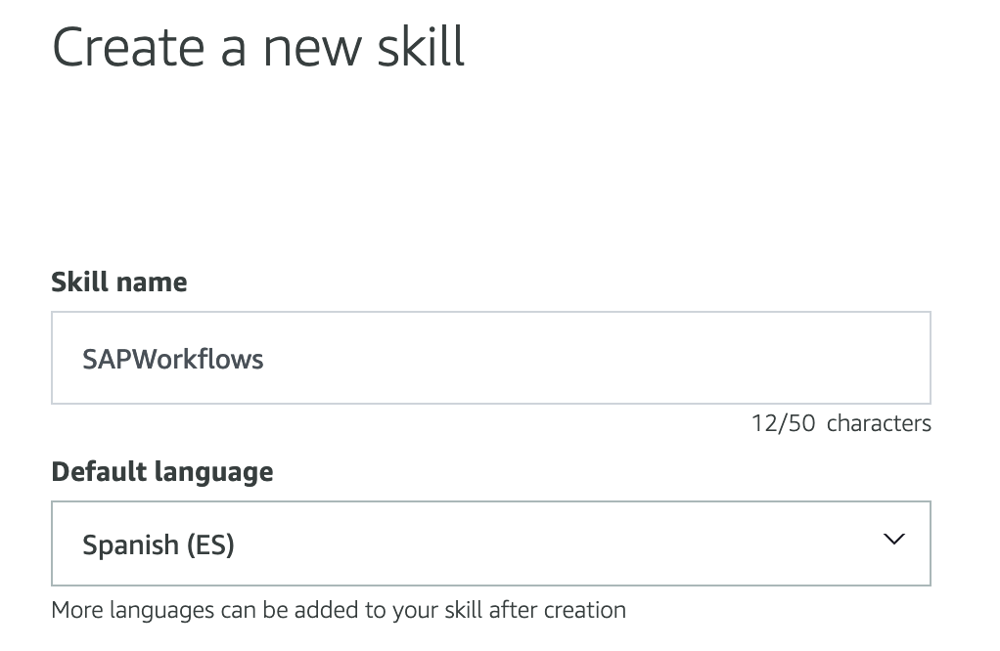

### Create Handler function in Lambda

1) Log in to Alexa Developer Console (https://developer.amazon.com/alexa/console/ask) with developer account. If you don't have, create a new one.

2) In the console press “Create Skill”:


3) Enter a name for Skill and the default language (NOTE: This language must be the same as configured on the device to be tested).



Select Custom Model:


And in host method select “Provision your own”


Then “Create Skill”

4) In the Template, select “Start from scratch”:


5) On the next screen, select “Interaction Model->JSON Editor”:


6) Copy and paste the following code:
```JSON
{
    "interactionModel": {
        "languageModel": {
            "invocationName": "bandeja sap",
            "intents": [
                {
                    "name": "AMAZON.FallbackIntent",
                    "samples": []
                },
                {
                    "name": "AMAZON.CancelIntent",
                    "samples": []
                },
                {
                    "name": "AMAZON.HelpIntent",
                    "samples": []
                },
                {
                    "name": "AMAZON.StopIntent",
                    "samples": [
                        "salir de bandeja",
                        "salir de bandeja sap"
                    ]
                },
                {
                    "name": "AMAZON.NavigateHomeIntent",
                    "samples": []
                },
                {
                    "name": "ContarItems",
                    "slots": [],
                    "samples": [
                        "cuantos pedidos tengo pendientes por aprobar",
                        "cantidad de documentos",
                        "cuantos documentos tengo",
                        "cuantos documentos tengo en la bandeja",
                        "cuantos documentos tengo pendientes",
                        "cuanto documentos tengo por aprobar"
                    ]
                },
                {
                    "name": "DocumentoAntiguo",
                    "slots": [],
                    "samples": [
                        "documento mas viejo",
                        "documento mas atrasado",
                        "cual es el documento mas antiguo",
                        "documento mas antiguo"
                    ]
                },
                {
                    "name": "AMAZON.YesIntent",
                    "samples": []
                },
                {
                    "name": "AMAZON.NoIntent",
                    "samples": []
                },
                {
                    "name": "AprobarPedido",
                    "slots": [],
                    "samples": [
                        "aprueba pedido",
                        "aprobar pedido"
                    ]
                },
                {
                    "name": "BuscarPedido",
                    "slots": [
                        {
                            "name": "nro_pedido",
                            "type": "AMAZON.NUMBER"
                        }
                    ],
                    "samples": [
                        "busca el pedido {nro_pedido}"
                    ]
                },
                {
                    "name": "BuscarPedidoPorNumero",
                    "slots": [
                        {
                            "name": "fin_nro_pedido",
                            "type": "AMAZON.FOUR_DIGIT_NUMBER"
                        }
                    ],
                    "samples": [
                        "busca el pedido que termina con {fin_nro_pedido}"
                    ]
                }
            ],
            "types": []
        }
    }
}
````

7) Press “Save Model” and then “Build Model”. The model will be built in a few seconds.

8) In the Alexa console select “Endpoint” and copy the Skill ID:


9) We return to our function in Lambda and select “Add Trigger”. For the trigger type select Alexa Skills Kit and indicate the Skill ID previously copied:


amzn1.ask.skill.cb0c71de-1df1-481e-8657-ed0d042998af

Then we copy the ARN of the Lambda function:


9) We return to the Alexa console and in default region paste the ARN of the lambda function previously copied:


Then “Save endpoints”

10) To test go to the top menu “Test” and indicate “Open SAP tray”. Alexa should reply with the Skill welcome message:


