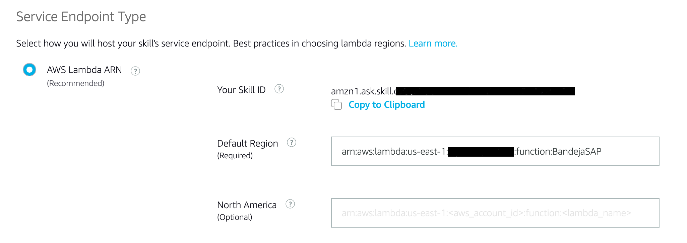

### Crear Skill para Alexa

1) Ingresar a Alexa Developer Console (https://developer.amazon.com/alexa/console/ask) con cuenta de desarrollador. Si no tiene, crear una nueva.

2) En la consola presionar "Create Skill":


3) Indicar un nombre para Skill y el lenguaje por defecto (NOTA: Este leguaje debe ser el mismo que esté configfurado en el dispositivo a probar).


Seleccionar modelo Custom:


Y en método de host seleccionar "Provision your own"


Luego "Create Skill"

4) En el Template, seleccionar "Start from scratch":


5) En la siguiente pantalla, seleccionar "Interaction Model->JSON Editor":


6) Copiar y pegar el siguiente código:

```JSON
{
    "interactionModel": {
        "languageModel": {
            "invocationName": "s a p inbox",
            "modelConfiguration": {
                "fallbackIntentSensitivity": {
                    "level": "LOW"
                }
            },
            "intents": [
                {
                    "name": "AMAZON.FallbackIntent",
                    "samples": []
                },
                {
                    "name": "AMAZON.CancelIntent",
                    "samples": []
                },
                {
                    "name": "AMAZON.HelpIntent",
                    "samples": []
                },
                {
                    "name": "AMAZON.StopIntent",
                    "samples": [
                        "exit",
                        "cancel"
                    ]
                },
                {
                    "name": "AMAZON.NavigateHomeIntent",
                    "samples": []
                },
                {
                    "name": "ContarItems",
                    "slots": [],
                    "samples": [
                        "How many documents do I have pending approval",
                        "number of documents",
                        "how many documents do i have",
                        "how many documents do i have in my inbox",
                        "how many documents do i have pending",
                        "how many documents do i have to approve"
                    ]
                },
                {
                    "name": "DocumentoAntiguo",
                    "slots": [],
                    "samples": [
                        "oldest document"
                    ]
                },
                {
                    "name": "AMAZON.YesIntent",
                    "samples": []
                },
                {
                    "name": "AMAZON.NoIntent",
                    "samples": []
                },
                {
                    "name": "AprobarPedido",
                    "slots": [],
                    "samples": [
                        "approve document"
                    ]
                },
                {
                    "name": "BuscarPedido",
                    "slots": [
                        {
                            "name": "nro_pedido",
                            "type": "AMAZON.NUMBER"
                        }
                    ],
                    "samples": [
                        "search document {nro_pedido}"
                    ]
                },
                {
                    "name": "BuscarPedidoPorNumero",
                    "slots": [
                        {
                            "name": "fin_nro_pedido",
                            "type": "AMAZON.FOUR_DIGIT_NUMBER"
                        }
                    ],
                    "samples": [
                        "search document ending with {fin_nro_pedido}"
                    ]
                }
            ],
            "types": []
        }
    }
}
````

7) Presionar "Save Model" y luego "Build Model". El módelo será construido en unos segundos.

8) En la consola de Alexa seleccionamos "Endpoint" y copiamos el Skill ID:



8) Volvemos a nuestra función en Lambda y seleccionamos "Add Trigger". Para el tipo de trigger seleccionamos Alexa Skills Kit e indicamos el Skill ID previamente copiado:


Luego copiamos el ARN de la función Lambda:


9) Volvemos a la consola de Alexa y en default region pegamos el ARN de la función lambda previamente copiado:


Luego "Save endpoints"

10) Para probar vamos al menu superior "Test" e indicamos  "Abre bandeja SAP". Alexa debería responder con el mensaje de bienvenida del Skill:


