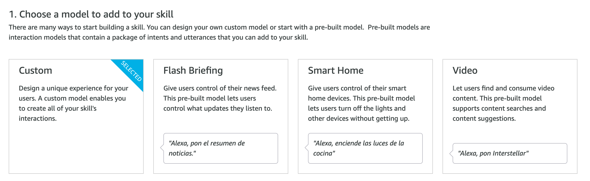
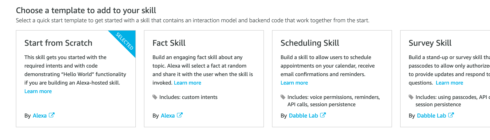
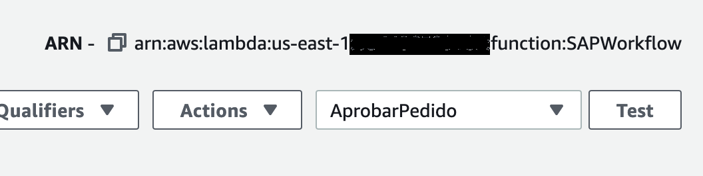
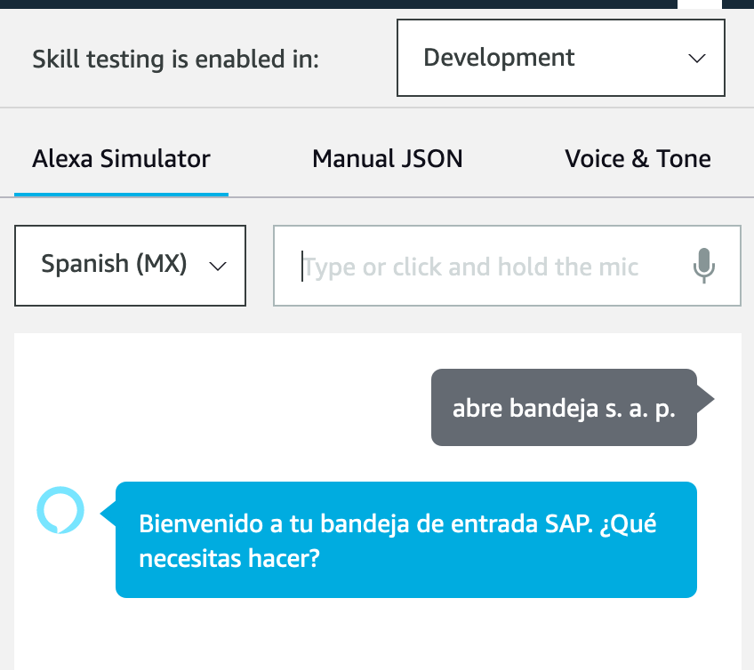

### Criar função Handler no Lambda

1) Faça login no Alexa Developer Console (https://developer.amazon.com/alexa/console/ask) com conta de desenvolvedor. Se você não tiver, crie um novo.

2) No console pressione “Criar habilidade”:


3) Digite um nome para Habilidade e o idioma padrão (NOTA: Este idioma deve ser o mesmo que configurado no dispositivo a ser testado).


Selecione o modelo personalizado:


E no método host selecione “Provisionar seu próprio”


Então “Criar Habilidade”

4) No Modelo, selecione “Começar do zero”:


5) Na próxima tela, selecione “Modelo de interação->Editor JSON”:


6) Copie e cole o seguinte código:

```JSON
{
    "interactionModel": {
        "languageModel": {
            "invocationName": "bandeja sap",
            "intents": [
                {
                    "name": "AMAZON.FallbackIntent",
                    "samples": []
                },
                {
                    "name": "AMAZON.CancelIntent",
                    "samples": []
                },
                {
                    "name": "AMAZON.HelpIntent",
                    "samples": []
                },
                {
                    "name": "AMAZON.StopIntent",
                    "samples": [
                        "salir de bandeja",
                        "salir de bandeja sap"
                    ]
                },
                {
                    "name": "AMAZON.NavigateHomeIntent",
                    "samples": []
                },
                {
                    "name": "ContarItems",
                    "slots": [],
                    "samples": [
                        "cuantos pedidos tengo pendientes por aprobar",
                        "cantidad de documentos",
                        "cuantos documentos tengo",
                        "cuantos documentos tengo en la bandeja",
                        "cuantos documentos tengo pendientes",
                        "cuanto documentos tengo por aprobar"
                    ]
                },
                {
                    "name": "DocumentoAntiguo",
                    "slots": [],
                    "samples": [
                        "documento mas viejo",
                        "documento mas atrasado",
                        "cual es el documento mas antiguo",
                        "documento mas antiguo"
                    ]
                },
                {
                    "name": "AMAZON.YesIntent",
                    "samples": []
                },
                {
                    "name": "AMAZON.NoIntent",
                    "samples": []
                },
                {
                    "name": "AprobarPedido",
                    "slots": [],
                    "samples": [
                        "aprueba pedido",
                        "aprobar pedido"
                    ]
                },
                {
                    "name": "BuscarPedido",
                    "slots": [
                        {
                            "name": "nro_pedido",
                            "type": "AMAZON.NUMBER"
                        }
                    ],
                    "samples": [
                        "busca el pedido {nro_pedido}"
                    ]
                },
                {
                    "name": "BuscarPedidoPorNumero",
                    "slots": [
                        {
                            "name": "fin_nro_pedido",
                            "type": "AMAZON.FOUR_DIGIT_NUMBER"
                        }
                    ],
                    "samples": [
                        "busca el pedido que termina con {fin_nro_pedido}"
                    ]
                }
            ],
            "types": []
        }
    }
}
````

7) Pressione “Salvar modelo” e, em seguida, “Build Model”. O modelo será construído em poucos segundos.

8) No console Alexa selecione “Endpoint” e copie o ID da habilidade:


Retornamos à nossa função no Lambda e selecionamos “Add Trigger”. Para o tipo de gatilho, selecione Alexa Skills Kit e indique o ID de habilidade copiado anteriormente:


Em seguida, copiamos o ARN da função Lambda:


9) Retornamos ao console Alexa e, na região padrão, colamos o ARN da função lambda anteriormente copiada:


Em seguida, “Salvar endpoints”

10) Para testar vá para o menu superior “Teste” e indique “Abrir bandeja SAP”. Alexa deve responder com a mensagem de boas-vindas da habilidade:


