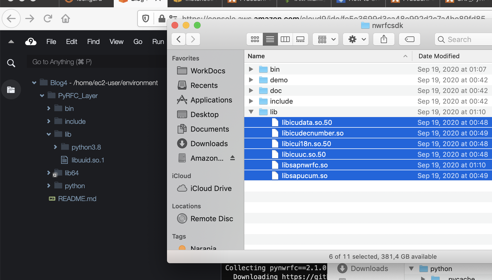
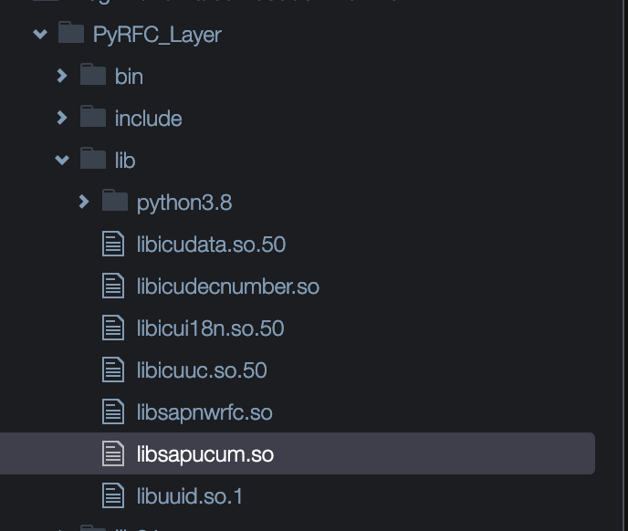
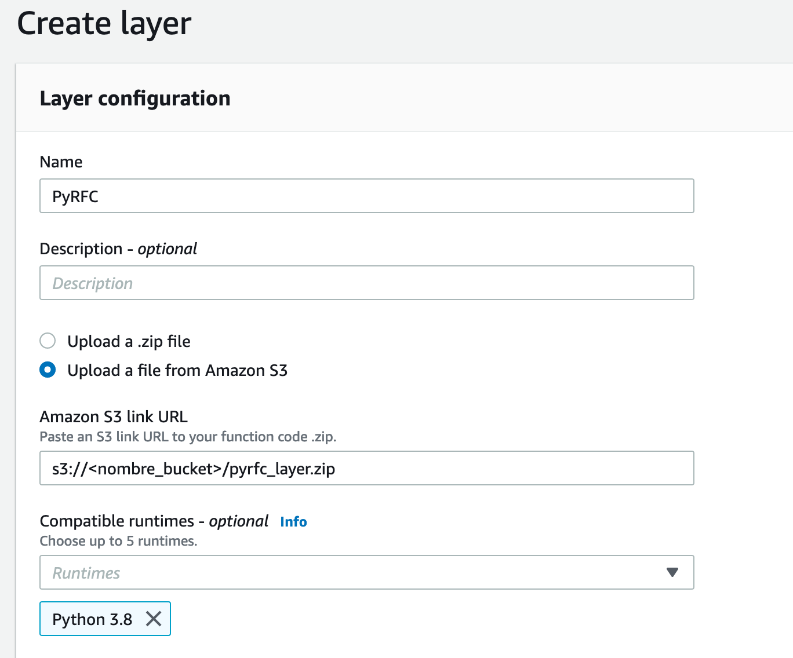

### Crear Layer Lambda para SAP PyRFC

1) Descargar SAP NW RFC SDK 7.50 desde SAP Marketplace (versión para LINUX ON X86_64 64 BITS). Descomprimir en alguna ruta, será utilizado en siguientes pasos.

2) En esta caso vamos a utilizar un entorno AWS Cloud9 basado en Amazon Linux 2 para generar Layer. Una guía paso a paso de como lanzar entornos Cloud9 en el siguiente link: https://docs.aws.amazon.com/cloud9/latest/user-guide/create-environment-main.html

3) Dentro del entorno de Cloud9, seleccionar Window->New Terminal y ejecutar los siguientes comandos shell para crear entorno Python e instalar dependencias necesarias:

```console
sudo yum install -y amazon-linux-extras
sudo amazon-linux-extras enable python3.8
sudo yum install python3.8 -y
virtualenv -p /usr/bin/python3.8 PyRFC_Layer
source PyRFC_Layer/bin/activate
cd PyRFC_Layer
mkdir python
cd python
pip3 install https://github.com/SAP/PyRFC/releases/download/2.1.0/pynwrfc-2.1.0-cp38-cp38-linux_x86_64.whl -t .
cp /usr/lib64/libuuid.so.1 /home/ec2-user/environment/PyRFC_Layer/lib
```

4) Copiar desde la carpeta resultante del paso 1 todos los archivos de la subcarpeta LIB hasta PyRFC_Layer/lib/ en Cloud9 (arrastrando y soltando):






5) Nuevamente abrir consola como paso 3 y ejecutar los siguientes comandos, reemplazado <nombre_bucket> con el bucket S3 destino donde almacenar Layer:

```console
cd /home/ec2-user/environment/PyRFC_Layer
zip -r9 pyrfc_layer.zip python lib
aws s3 cp pyrfc_layer.zip s3://<nombre_bucket>/pyrfc_layer.zip
```

6) En la consola AWS ingresar a servicio Lambda, seleccionar Additional Resources->Layers->Create layer.

7) Indicar algún nombre y ruta S3 indicada anteriormente (modificado <nombre_bucket>) y Runtime compatible Python 3.8:



8) Luego de crear exitósamente Layer, ya puede ser utilizado en Lambda. El siguiente es un ejemplo de código para invocar función demo ABAP:

```python
import json
from pyrfc import Connection

def lambda_handler(event, context):

    con = Connection(ashost='<IP_SAP_AS_ABAP>', sysnr='<NUMERO_SISTEMA>', client='<MANDANTE>', user='<USUARIO>', passwd='<PASSWORD>')
    resultado = con.call('STFC_CONNECTION', REQUTEXT=u'Hola SAP!')

    print (resultado)  

    return {
        'statusCode': 200,
        'body': json.dumps('Conectado con SAP!')
    }
```
