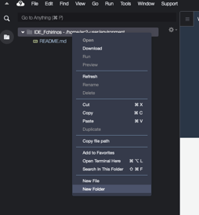

### Crear Layer Lambbda para SAP PyRFC

1) Descargar SAP NW RFC SDK 7.50 desde SAP Marketplace (versión para LINUX ON X86_64 64 BITS). Descomprimir en alguna ruta, será utilizado en siguientes pasos.

2) Para esta caso, vamos a utilizar un entorno AWS Cloud9 basado en Amazon Linux 2 para generar Layer. Una guía paso a paso de como lanzar el ambiente en el siguiente link: https://docs.aws.amazon.com/cloud9/latest/user-guide/create-environment-main.html

3) En Cloud9 creamos una carpeta llamada "PyRFC_Layer"

  

  

4) Sobre la carpeta creada anteriormente presionar click secundario y luego "Open Terminal Here"


5) En la consola, ejecutar el siguiente script:

```console
mkdir python lib
cd python
pip3 install https://github.com/SAP/PyRFC/releases/download/2.1.0/pynwrfc-2.1.0-cp38-cp38-linux_x86_64.whl -t .
```

6) Copiar de la carpeta resultante del paso 1 la subcarpeta LIB a la raiz del proyecto en Cloud9.


7) Nuevamente abrir consola como paso 4 y ejecutar los siguientes comandos, reemplazado <nombre_bucket> con el destino para almacenar Layer:

```console
zip -r9 pyrfc_layer.zip python lib
aws s3 cp pyrfc_layer.zip s3://<nombre_bucket>/pyrfc_layer.zip
```
