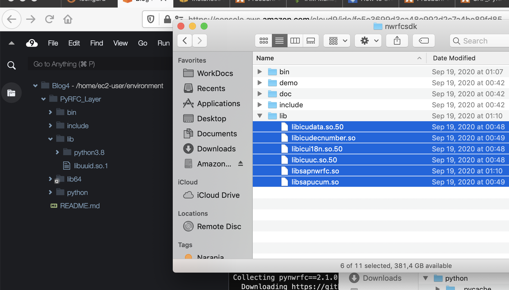
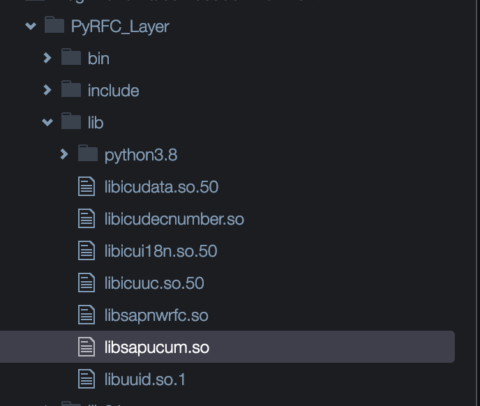

### Criar camada Lambbda para SAP PyRFC

1) Baixe SAP NW RFC SDK 7.50 do SAP Marketplace (versão para LINUX EM X86_64 64 BITS). Descompacte em alguma rota, ele será usado nas seguintes etapas.

2) Nesse caso, usaremos um ambiente AWS Cloud9 baseado no Amazon Linux 2 para gerar Layer. Um guia passo a passo sobre como iniciar ambientes Cloud9 no seguinte link: https://docs.aws.amazon.com/cloud9/latest/user-guide/create-environment-main.html

3) Dentro do ambiente Cloud9, selecione Window-> New Terminal e execute os seguintes comandos shell para criar ambiente Python e instalar dependências necessárias:

```console
sudo yum install -y amazon-linux-extras
sudo amazon-linux-extras enable python3.8
sudo yum install python3.8 -y
virtualenv -p /usr/bin/python3.8 PyRFC_Layer
source PyRFC_Layer/bin/activate
cd PyRFC_Layer
mkdir python
cd python
pip3 install https://github.com/SAP/PyRFC/releases/download/2.1.0/pynwrfc-2.1.0-cp38-cp38-linux_x86_64.whl -t .
cp /usr/lib64/libuuid.so.1 /home/ec2-user/environment/PyRFC_Layer/lib
```

4) Copie da pasta resultante na etapa 1 todos os arquivos na subpasta LIB para Pyrfc_layer/lib/ no Cloud9 (arrastando e soltando):






5) Novamente abra o console como etapa 3 e execute os seguintes comandos, <nombre_bucket> substituídos pelo bucket S3 de destino onde armazenar Camada:

```console
cd /home/ec2-user/environment/PyRFC_Layer
zip -r9 pyrfc_layer.zip python lib
aws s3 cp pyrfc_layer.zip s3://<nombre_bucket>/pyrfc_layer.zip
```

6) No console da AWS, insira o serviço do Lambda, selecione Recursos Adicionais-> Camadas->Criar camada.

7) Digite algum nome S3 e caminho indicado acima (modificado <nombre_bucket>) e Python 3.8 compatível Runtime:


8) Depois de criar Camada com sucesso, ela já pode ser usada no Lambda. O seguinte é um código de exemplo para invocar a função de demonstração ABAP:

```python
import json
from pyrfc import Connection

def lambda_handler(event, context):

    con = Connection(ashost='<IP_SAP_AS_ABAP>', sysnr='<NUMERO_SISTEMA>', client='<MANDANTE>', user='<USUARIO>', passwd='<PASSWORD>')
    resultado = con.call('STFC_CONNECTION', REQUTEXT=u'Hola SAP!')

    print (resultado)  

    return {
        'statusCode': 200,
        'body': json.dumps('Conectado con SAP!')
    }
```
