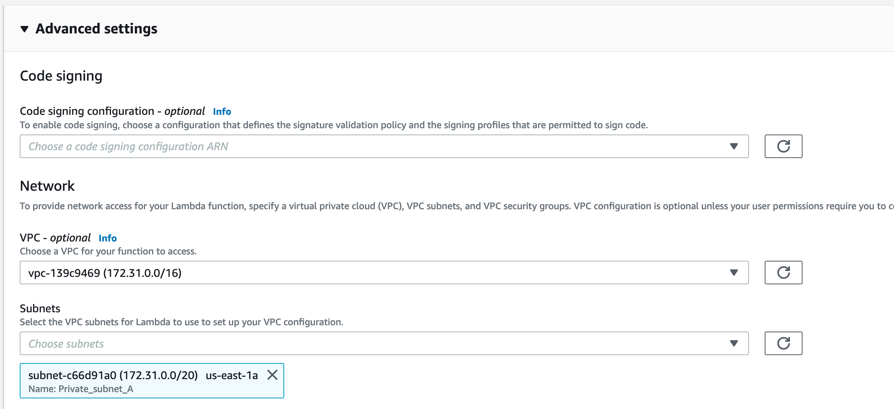
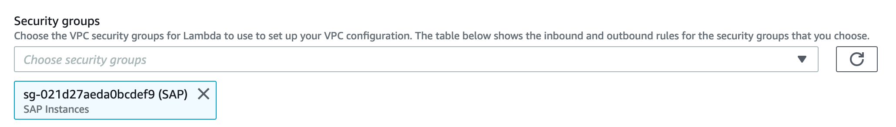
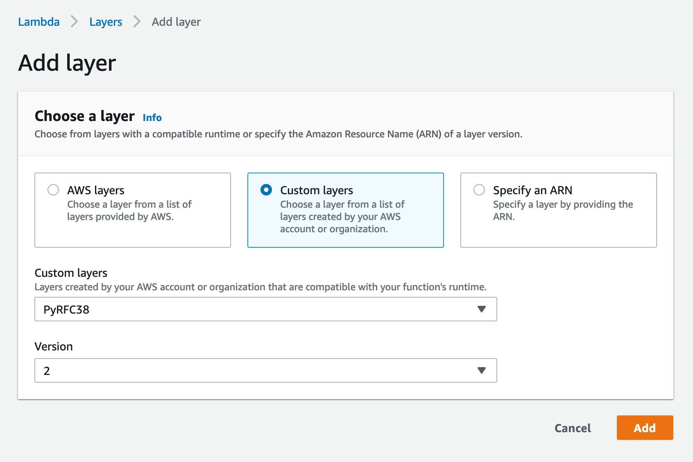

### Create Lambda Handler function

1) Within Lambda, create the function that will have the logic to respond to requests from Alexa (runtime Python 3.8):


Select the VPC and subnet where the SAP instance is located, also select a security group with access to ports 33 (ABAP system number):






2) After creating the function, select the Layer created in previous steps:



3) Copy and paste the following code:

```Python
from __future__ import print_function
from pyrfc import Connection
import re
USERID = <usuario sap>
PASSWD = <password>
LANG = 'ES'
SAPHOST= <IP Servidor ABAP>
SAPINSTANCENUM= <Número de instancia>
SAPCLIENT= <Mandante>

WORKLIST = []
PO_HEADER = { }
PO_ITEMS = []
oldest_wi = ''

conn = Connection(ashost=SAPHOST, sysnr=SAPINSTANCENUM, client=SAPCLIENT, user=USERID, passwd=PASSWD)

# --------------- Helpers that build all of the responses ----------------------

def build_speechlet_response(title, output, reprompt_text, should_end_session):
    return {
        'outputSpeech': {
#            'type': 'SSML',
#            'text' : '<speak> ' + output + ' </speak>'
#            'type': 'PlainText',
#            'text' : output
            'type': 'SSML',
            'ssml' : '<speak> ' + output + ' </speak>'

        },
        'card': {
            'type': 'Simple',
            'title': "SessionSpeechlet - " + title,
            'content': "SessionSpeechlet - " + output
        },
        'reprompt': {
            'outputSpeech': {
#                'type': 'SSML',
#                'text' : '<speak> ' +  reprompt_text + ' </speak>'
#                'type': 'PlainText',
#                'text' : reprompt_text
                'type': 'SSML',
                'ssml' : '<speak> ' + str(reprompt_text) + ' </speak>'
            }
        },
        'shouldEndSession': should_end_session
    }


def build_response(session_attributes, speechlet_response):
    return {
        'version': '1.0',
        'sessionAttributes': session_attributes,
        'response': speechlet_response
    }


# --------------- Functions that control the skill's behavior ------------------
def get_welcome_response():
    session_attributes = {}
    card_title = "Welcome"
    speech_output = "Welcome to your S A P inbox. " \
                    "¿What dou you want to do?"
    reprompt_text = "I'm sorry, I did not undestand"
    should_end_session = False
    return build_response(session_attributes, build_speechlet_response(
        card_title, speech_output, reprompt_text, should_end_session))


def handle_session_end_request():
    card_title = "Session Ended"
    speech_output = "Closing S A P inbox. " \
                    "Goodbye! "
    # Setting this to true ends the session and exits the skill.
    should_end_session = True
    return build_response({}, build_speechlet_response(
        card_title, speech_output, None, should_end_session))

def create_nro_pedido(nro_pedido):
    return {"nro_pedido": nro_pedido}


def get_nropedido_from_session(intent, session):
    session_attributes = {}
    reprompt_text = None

    if session.get('attributes', {}) and "nro_pedido" in session.get('attributes', {}):
        nro_pedido = session['attributes']['nro_pedido']
        speech_output = "Numero Pedido " + nro_pedido
        should_end_session = False

    return build_response(session_attributes, build_speechlet_response(
        intent['name'], speech_output, reprompt_text, should_end_session))

def get_ContarItems(intent, session):
    session_attributes = {}
    reprompt_text = None
    # Llamar BAPI
    result = conn.call("SAP_WAPI_CREATE_WORKLIST", USER=USERID, LANGUAGE=LANG, WORKLIST=WORKLIST)

    #Pregunta 1 - Cuantos items tengo por aprobar?
    wi_pendientes = len(result["WORKLIST"])
    print (wi_pendientes)

    speech_output = "You have " + str(wi_pendientes) + " documents pending for approval." \
                        ". ¿Anything else that you need?."
    should_end_session = False

    return build_response(session_attributes, build_speechlet_response(
        intent['name'], speech_output, reprompt_text, should_end_session))

def get_DocumentoAntiguo(intent, session):
    session_attributes = {}
    reprompt_text = None
    result = conn.call("SAP_WAPI_CREATE_WORKLIST", USER=USERID, LANGUAGE=LANG, WORKLIST=WORKLIST)
    #Pregunta 1 - Cuantos items tengo por aprobar?
    oldest_wi = ''
    for x in result["WORKLIST"]:
        #Pregunta 2: Cuál es el pedido mas atrasado por aprobar?.
        if oldest_wi == '':
            oldest_wi = x.get('WI_ID')
            oldest_text = x.get('WI_TEXT')
            oldest_cd = x.get('WI_CD')
            oldest_ct = x.get('WI_CT')
    m = re.search(r'\d\d\d\d\d\d\d\d\d\d', x.get('WI_TEXT'))
    nro_pedido = m.group(0)
    session_attributes = create_nro_pedido(nro_pedido)
    should_end_session = False

    speech_output = 'The oldest document is : <say-as interpret-as="telephone">' + str(nro_pedido) + \
    '</say-as> and was created on <say-as interpret-as="date">' + oldest_cd + ' </say-as> ¿Do you want more details?'

    return build_response(session_attributes, build_speechlet_response(
        intent['name'], speech_output, reprompt_text, should_end_session))

    return get_welcome_response()

def get_error():
    session_attributes = {}
    card_title = "Error"
    speech_output = "I'm sorry, I didn't understand" \
                    "What do you need to do?"
    reprompt_text = "Can you repeat please? "
    should_end_session = False
    return build_response(session_attributes, build_speechlet_response(
        card_title, speech_output, reprompt_text, should_end_session))

def get_detallepedido(intent, session):
    session_attributes = {}
    reprompt_text = ''
    card_title = "Document Details"
    if session.get('attributes', {}) and "nro_pedido" in session.get('attributes', {}):
        nro_pedido = session['attributes']['nro_pedido']
        pedido = conn.call("BAPI_PO_GETDETAIL", ITEMS='X', PURCHASEORDER=nro_pedido, PO_HEADER=PO_HEADER, PO_ITEMS=PO_ITEMS)
        proveedor = pedido["PO_HEADER"].get('VEND_NAME')
        print(proveedor)
        for l_pedido in pedido["PO_ITEMS"]:
            material = l_pedido.get('SHORT_TEXT')
            cantidad = l_pedido.get('QUANTITY')
            monto_total = l_pedido.get('GROS_VALUE')
        speech_output = 'The document <say-as interpret-as="telephone">' + str(nro_pedido) + "</say-as> is it for the supplier " + proveedor + \
        ". for a total amount of " + str(int(monto_total)) + " U S Dollars. Corresponds to the purchase of " + str(int(cantidad)) + " " + material + \
        '. <break time="1s"/> If you want me to approve it say: Approve Document'
        session_attributes = create_nro_pedido(nro_pedido)
        should_end_session = False
        return build_response(session_attributes, build_speechlet_response(
            card_title, speech_output, reprompt_text, should_end_session))
    else:
        speech_output = "i don't have an order number"
        should_end_session = False
        return build_response(session_attributes, build_speechlet_response(
            card_title, speech_output, reprompt_text, should_end_session))


def get_no(intent, session):
    session_attributes = {}
    reprompt_text = ''
    card_title = "Order Detail"
    speech_output = ""
    should_end_session = False
    return build_response(session_attributes, build_speechlet_response(
        card_title, speech_output, reprompt_text, should_end_session))

def get_apruebapedido(intent, session):
    session_attributes = {}
    reprompt_text = ''
    card_title = "Approve Document"
    if session.get('attributes', {}) and "nro_pedido" in session.get('attributes', {}):
        nro_pedido = session['attributes']['nro_pedido']
        bapi_aprobar = conn.call("BAPI_PO_RELEASE", PURCHASEORDER=nro_pedido, PO_REL_CODE='MA', USE_EXCEPTIONS='X')
        speech_output = 'Document <say-as interpret-as="telephone">' + str(nro_pedido) + '</say-as> approved.'
        should_end_session = False
        return build_response(session_attributes, build_speechlet_response(
            card_title, speech_output, reprompt_text, should_end_session))
    else:
        speech_output = "I don't have an order number"
        should_end_session = False
        return build_response(session_attributes, build_speechlet_response(
            card_title, speech_output, reprompt_text, should_end_session))


def get_buscarpedido(intent, session):
    session_attributes = {}
    reprompt_text = ''
    busca_nro_pedido = intent['slots']['nro_pedido']['value']
    card_title = "Search document"
    speech_output = "Search document " + busca_nro_pedido

    should_end_session = False
    return build_response(session_attributes, build_speechlet_response(
        card_title, speech_output, reprompt_text, should_end_session))

def get_buscarpedidopornumero(intent, session):
    session_attributes = {}
    reprompt_text = ''
    card_title = "Search document by number"
    fin_nro_pedido = intent['slots']['fin_nro_pedido']['value']

    result = conn.call("SAP_WAPI_CREATE_WORKLIST", USER=USERID, LANGUAGE=LANG, WORKLIST=WORKLIST)
    #Pregunta 1 - Cuantos items tengo por aprobar?

    nro_pedido = ''
    session_attributes = create_nro_pedido(nro_pedido)

    for x in result["WORKLIST"]:
        wi = x.get('WI_ID')
        wi_text = x.get('WI_TEXT')

        encontrado = wi_text.find(fin_nro_pedido)

        if encontrado != -1:
            m = re.search(r'\d\d\d\d\d\d\d\d\d\d', wi_text)
            nro_pedido = m.group(0)
            session_attributes = create_nro_pedido(nro_pedido)
            speech_output = 'I found the pending document number <say-as interpret-as="telephone">' + str(nro_pedido) + '</say-as>. Do you want to know more details?'

        if nro_pedido == '':
            speech_output = "I did not find any documents"


    should_end_session = False
    return build_response(session_attributes, build_speechlet_response(
        card_title, speech_output, reprompt_text, should_end_session))

# --------------- Events ------------------

def on_session_started(session_started_request, session):
    """ Called when the session starts """

    print("on_session_started requestId=" + session_started_request['requestId']
          + ", sessionId=" + session['sessionId'])


def on_launch(launch_request, session):
    """ Called when the user launches the skill without specifying what they
    want
    """

    print("on_launch requestId=" + launch_request['requestId'] +
          ", sessionId=" + session['sessionId'])
    # Dispatch to your skill's launch
    return get_welcome_response()


def on_intent(intent_request, session):
    """ Called when the user specifies an intent for this skill """

    print("on_intent requestId=" + intent_request['requestId'] +
          ", sessionId=" + session['sessionId'])

    intent = intent_request['intent']
    intent_name = intent_request['intent']['name']

    # Dispatch to your skill's intent handlers
    if intent_name == "AMAZON.HelpIntent":
        return get_welcome_response()
    elif intent_name == "AMAZON.CancelIntent" or intent_name == "AMAZON.StopIntent":
        return handle_session_end_request()
    elif intent_name == "ContarItems":
        return get_ContarItems(intent, session)
    elif intent_name == "DocumentoAntiguo":
        return get_DocumentoAntiguo(intent, session)
    elif intent_name == "AMAZON.YesIntent":
        return get_detallepedido(intent, session)
    elif intent_name == "AMAZON.NoIntent":
        return get_no(intent, session)
    elif intent_name == "AprobarPedido":
        return get_apruebapedido(intent, session)
    elif intent_name == "BuscarPedido":
        return get_buscarpedido(intent, session)
    elif intent_name == "BuscarPedidoPorNumero":
        return get_buscarpedidopornumero(intent, session)
    elif intent_name == "AMAZON.FallbackIntent":
        return get_error()
    else:
        return get_error()
#        raise ValueError("Invalid intent")


def on_session_ended(session_ended_request, session):
    """ Called when the user ends the session.

    Is not called when the skill returns should_end_session=true
    """
    print("on_session_ended requestId=" + session_ended_request['requestId'] +
          ", sessionId=" + session['sessionId'])
    # add cleanup logic here


# --------------- Main handler ------------------

def lambda_handler(event, context):
    """ Route the incoming request based on type (LaunchRequest, IntentRequest,
    etc.) The JSON body of the request is provided in the event parameter.
    """
    print("event.session.application.applicationId=" +
          event['session']['application']['applicationId'])

    """
    Uncomment this if statement and populate with your skill's application ID to
    prevent someone else from configuring a skill that sends requests to this
    function.
    """
    # if (event['session']['application']['applicationId'] !=
    #         "amzn1.echo-sdk-ams.app.[unique-value-here]"):
    #     raise ValueError("Invalid Application ID")

    if event['session']['new']:
        on_session_started({'requestId': event['request']['requestId']},
                           event['session'])

    if event['request']['type'] == "LaunchRequest":
        return on_launch(event['request'], event['session'])
    elif event['request']['type'] == "IntentRequest":
        return on_intent(event['request'], event['session'])
    elif event['request']['type'] == "SessionEndedRequest":
        return on_session_ended(event['request'], event['session'])

```
