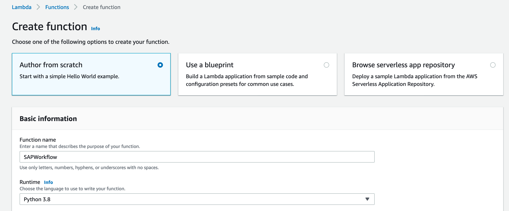
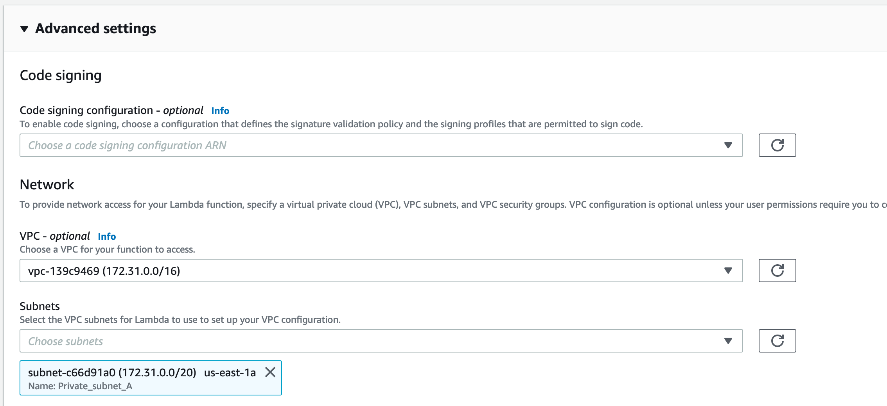

### Crear función Handler en Lambda

1) Dentro de Lambda, creamos la función que tendrá la lógica para responder a solicitudes a Alexa (runtime Python 3.8):



Seleccionamos VPC y subnet donde se encuentre instancia SAP, además de grupo de seguridad con acceso a puertos 33(nro de instancia):




2) Luego de crear la función, seleccionar el Layer creado en pasos anteriores:


3) Copiar y pegar el siguiente código:

```Python
{
Poner Python Lambda aquí.
    }]
}
```
